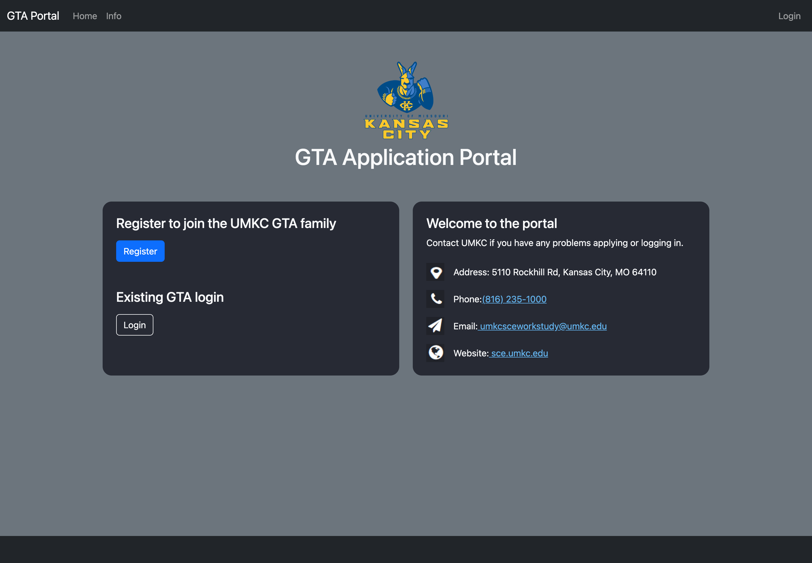
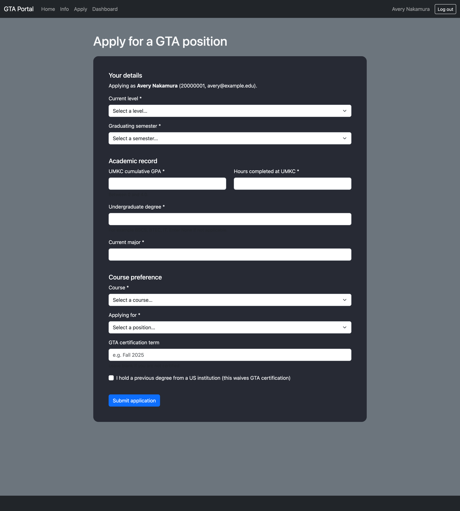
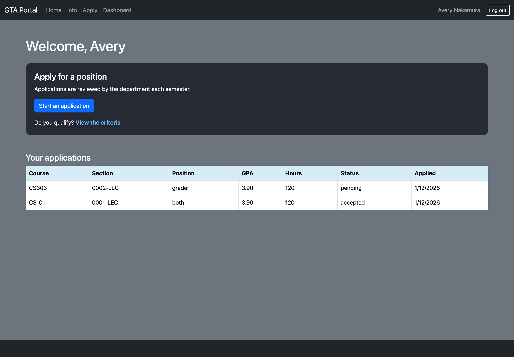
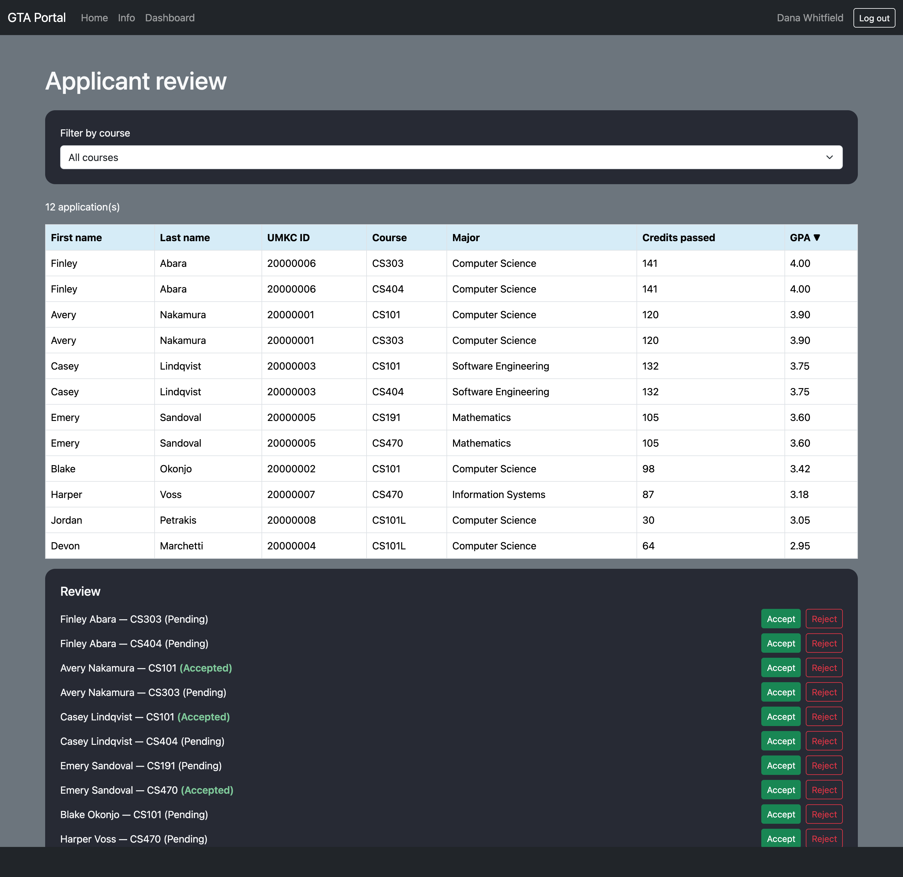
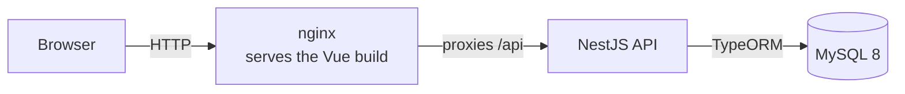

# GTA Portal

A full-stack web app for managing Graduate Teaching Assistant hiring. Students
apply for grader and lab-instructor positions; department admins review, sort
and decide on applicants course by course.

Vue 3 + Vite on the front, NestJS + TypeScript on the back, MySQL 8 underneath,
the whole thing running from a single `docker compose up`.

## Screenshots

| Home | Application form |
| --- | --- |
|  |  |

| Student dashboard | Admin review |
| --- | --- |
|  |  |

## Features

**For students**
- Register and sign in with a real password, hashed with bcrypt
- Submit an application for a specific course section, with client- and
  server-side validation on GPA, completed hours and every other field
- Track the status of every application submitted — pending, accepted, rejected

**For admins**
- Review all applications in one table, filtered by course
- Sort by GPA, completed hours, or applicant name, ascending or descending
- Accept or reject an application inline

**Throughout**
- JWT authentication with role-based access control enforced server-side
- Live, interactive API documentation at `/api/docs`
- Keyboard-navigable forms: every input is labelled, errors are announced, and
  sortable table headers expose `aria-sort`

## Tech stack

| Layer | Technology |
| --- | --- |
| Frontend | Vue 3 (Composition API, `<script setup>`), Vite, Pinia, Vue Router, TypeScript, Bootstrap 5 |
| Backend | NestJS 11, TypeScript, TypeORM, Passport JWT, class-validator, Swagger |
| Database | MySQL 8 |
| Testing | Jest + Supertest (API), Vitest + Vue Test Utils (web) |
| Infrastructure | Docker Compose, nginx, GitHub Actions |

## Architecture



```mermaid
erDiagram
  users ||--o| students : "profile"
  users ||--o{ applications : "submits"
  courses ||--o{ applications : "receives"
  users ||--o{ student_courses : "completed"
  courses ||--o{ student_courses : "taken by"

  users {
    int id PK
    char umkc_id UK
    varchar email UK
    char password_hash
    enum role
    varchar first_name
    varchar last_name
  }
  students {
    int user_id PK_FK
    varchar contact_no
    bool certified
  }
  courses {
    int id PK
    varchar course_no
    varchar course_name
    varchar section
    varchar instructor
  }
  applications {
    int id PK
    int user_id FK
    int course_id FK
    decimal gpa
    smallint hrs_completed
    enum curr_level
    enum position
    enum status
    datetime applied_at
  }
  student_courses {
    int user_id PK_FK
    int course_id PK_FK
    char grade
  }
```

## Quick start

```bash
git clone https://github.com/UMKCGroupProject/UMKCDepartmentProject.git
cd UMKCDepartmentProject
docker compose up
```

Then open **<http://localhost:8080>**. The database is created and seeded on
first boot, so you can log in immediately:

| Role | Email | Password |
| --- | --- | --- |
| Admin | `admin@example.edu` | `Password123!` |
| Student | `avery@example.edu` | `Password123!` |

All seed data is fictional — invented names, courses and instructors on the
reserved `example.edu` domain.

## API

Interactive Swagger docs run at **<http://localhost:3000/api/docs>**. Sign in via
`POST /auth/login`, then paste the returned token into **Authorize**.

| Method | Endpoint | Access |
| --- | --- | --- |
| `POST` | `/auth/register` | Public |
| `POST` | `/auth/login` | Public |
| `GET` | `/auth/me` | Authenticated |
| `GET` | `/courses` | Authenticated |
| `POST` | `/applications` | Authenticated |
| `GET` | `/applications/mine` | Authenticated |
| `GET` | `/applications?courseId=&sortBy=&order=&page=&limit=` | Admin |
| `PATCH` | `/applications/:id/status` | Admin |

`sortBy` accepts `gpa`, `hrsCompleted`, `lastName`, `firstName` or `appliedAt`.
It is an enum mapped to a column in code, so an unrecognised value is rejected
with a 400 and never reaches the database.

## Local development

Run the database in Docker and both apps on the host for hot reload.

```bash
# Database
docker run -d --name gta-db -p 3306:3306 \
  -e MYSQL_ROOT_PASSWORD=rootpw -e MYSQL_DATABASE=gta_portal \
  -e MYSQL_USER=gta -e MYSQL_PASSWORD=gtapw \
  -v "$PWD/db:/docker-entrypoint-initdb.d:ro" mysql:8

# API — http://localhost:3000
cd api && cp .env.example .env   # set JWT_SECRET to 32+ characters
npm install && npm run start:dev

# Web — http://localhost:5173
cd web && cp .env.example .env
npm install && npm run dev
```

The Vite dev server proxies `/api` to port 3000, so no CORS setup is needed.

## Testing

```bash
cd api && npm test          # unit tests
cd api && npm run test:e2e   # API tests against a live database
cd web && npm test           # component, store and router tests
```

The API suite covers authentication, role enforcement, input validation and the
sort-field whitelist. The web suite covers the auth store, router guards, and
the form components.

## Project structure

```
api/                 NestJS API
  src/
    auth/            controller, service, JWT strategy, DTOs
    users/           user + student entities
    courses/         controller, service, entity
    applications/    controller, service, entity, DTOs
    common/          guards, decorators, exception filter
    config/          env validation
  test/              Supertest e2e specs
web/                 Vue 3 + Vite frontend
  src/
    api/             axios instance and interceptors
    stores/          Pinia auth store
    router/          routes and navigation guards
    layouts/         shared page shell
    components/      FormField, DataTable, header, footer
    views/           one component per route
  tests/             Vitest specs
db/                  schema and seed SQL, run on first boot
docs/screenshots/
```

## License

MIT — see [LICENSE](LICENSE).
